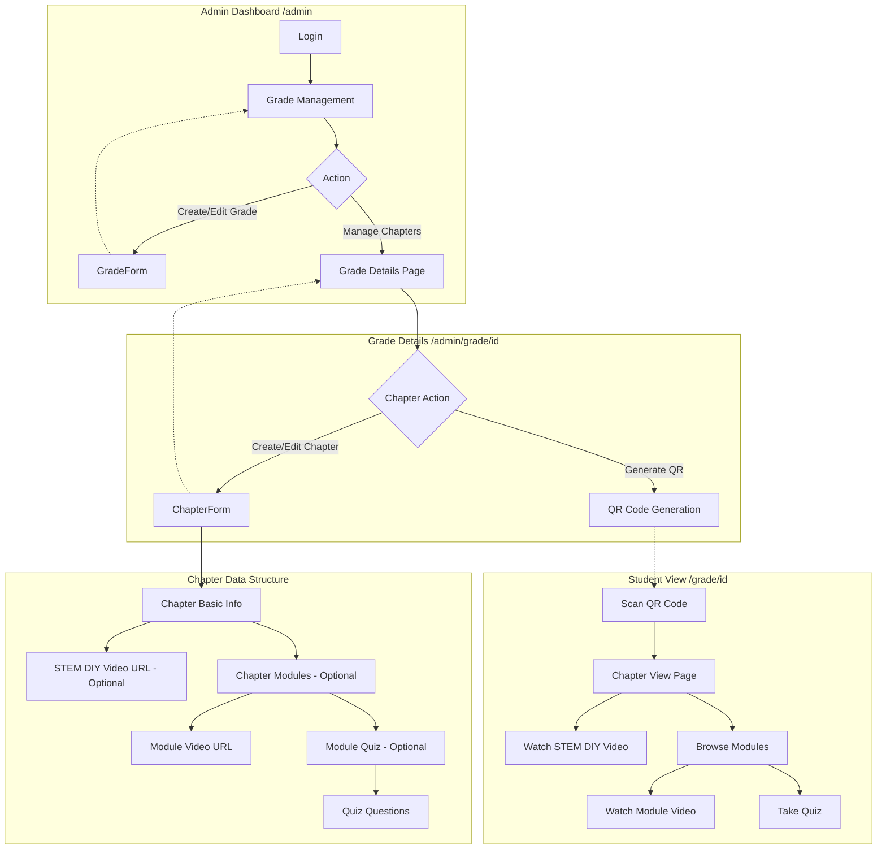
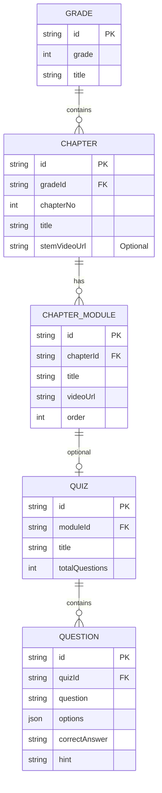

# Project Flowchart & Architecture

This document provides a visual representation of the Book QR Code project, detailing the data hierarchy and the administrative workflow.

## 1. System Architecture Flowchart

## 2. Data Model Relationship (Entity-Relationship)

## 3. Administrative Workflow Detail

1.  **Grade Creation**: Admin starts by defining a Grade (e.g., Grade 1, Grade 2).
2.  **Chapter Setup**: For each Grade, chapters are added.
    *   **STEM DIY Video**: A specific video URL for the entire chapter (often a hands-on activity).
3.  **Module Integration (Optional)**: Chapters can be broken down into smaller modules.
    *   **Module Videos**: Targeted educational videos for specific topics within the chapter.
    *   **Interactive Quizzes**: Each module can optionally include a quiz to test knowledge.
4.  **Distribution**: Once content is ready, a QR code is generated for the chapter, allowing students to access the digital content directly from their physical textbooks.
